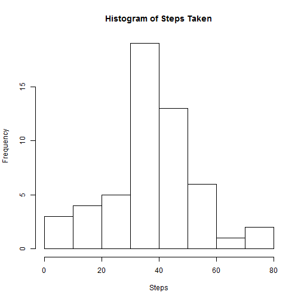
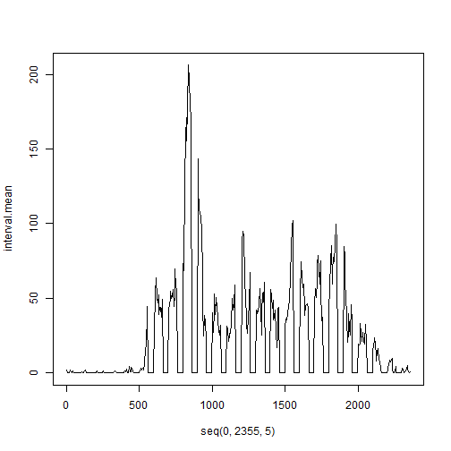
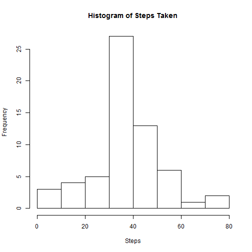
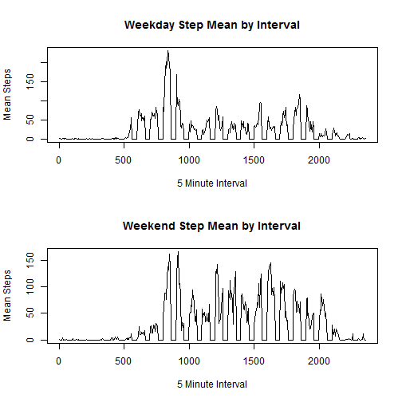

#Step Monitoring Analysis
This report is a submission for the reproducible research course on coursera. The project description follows.

"It is now possible to collect a large amount of data about personal movement using activity monitoring devices such as a Fitbit, Nike Fuelband, or Jawbone Up. These type of devices are part of the "quantified self" movement - a group of enthusiasts who take measurements about themselves regularly to improve their health, to find patterns in their behavior, or because they are tech geeks. But these data remain under-utilized both because the raw data are hard to obtain and there is a lack of statistical methods and software for processing and interpreting the data.

This assignment makes use of data from a personal activity monitoring device. This device collects data at 5 minute intervals through out the day. The data consists of two months of data from an anonymous individual collected during the months of October and November, 2012 and include the number of steps taken in 5 minute intervals each day."

##Loading and preprocessing the data
Load into data the activity data, make sure activity.csv is in your working directory.

```r
data <- read.csv("C:/Users/Steven/Documents/R/repdata-data-activity/activity.csv", colClasses=c("numeric","POSIXct","numeric"))
```
Find the mean steps for each day

```r
library(lubridate)
date=ymd("2012-10-01 Pacific")
tz(date)="US/Pacific"
iterator=1
day.step.mean<-numeric(length=61)
for (iterator in 1:61) 
{
    day.step.mean[iterator]<-mean(data$steps[date==data$date],na.rm=TRUE)
    date<-date+days(1)
    iterator<-iterator+1
}
```
Find the mean steps for each time interval each day

```r
iterator=1
interval.mean<-numeric(length=472)
for (iterator in 1:472) 
{
    interv=5*iterator-5
    interval.mean[iterator]<-mean(data$steps[data$interval==interv],na.rm=TRUE)
    iterator<-iterator+1
}
interval.mean[is.nan(interval.mean)]=0
```

##What is mean total number of steps taken per day?
A histogram of the number of steps taken each day ignoring missing data:

```r
hist(day.step.mean, xlab="Steps", main="Histogram of Steps Taken")
```

 

Ignoring the missing data, the mean number of steps per day is given by:

```r
mean(day.step.mean, na.rm=TRUE)
```

```
## [1] 37.3826
```
Ignoring the missing data, the median number of steps per day is given by:

```r
median(day.step.mean, na.rm=TRUE)
```

```
## [1] 37.37847
```
##What is the average daily activity pattern?
A time series plot of the 5-minute interval and the average number of steps taken, averaged across all days:

```r
plot(seq(0,2355,5),interval.mean,type='l')
```

 
To find the time interval which has the maximum average step activity:

```r
seq(0,2355,5)[which.max(interval.mean)]
```

```
## [1] 835
```
This means the 835th 5 minute time interval sees the most activity. 

##Inputting missing values
The number of rows in the dataset with NA values is:

```r
sum(is.na(data$steps))
```

```
## [1] 2304
```
Now a new dataset is created by replacing the missing values in the existing data set with the mean for that time slot:

```r
iterator <- 1
no.missing.data<-data
for (iterator in 1:17568){
    if(is.na(data$steps[iterator])){
        no.missing.data$steps[iterator]<-interval.mean[data$interval[iterator]/5+1]
        }
    iterator <- iterator + 1
}
```
Find the mean steps for each day from the data without missing values:

```r
date=ymd("2012-10-01")
tz(date)="US/Pacific"
iterator=1
no.missing.day.step.mean<-numeric(length=61)
for (iterator in 1:61) 
{
    no.missing.day.step.mean[iterator]<-mean(no.missing.data$steps[date==data$date],na.rm=TRUE)
    date<-date+days(1)
    iterator<-iterator+1
}
```

A histogram of the number of steps taken each day without any missing data:

```r
hist(no.missing.day.step.mean, xlab="Steps", main="Histogram of Steps Taken")
```

 

Without any missing data, the mean number of steps per day is given by:

```r
mean(no.missing.day.step.mean, na.rm=TRUE)
```

```
## [1] 37.3826
```
Without any missing data, the median number of steps per day is given by:

```r
median(no.missing.day.step.mean, na.rm=TRUE)
```

```
## [1] 37.3826
```
##Are there differences in activity patterns between weekdays and weekends?
Add a new factor column to the data dictating whether the day is a weekday or weekend:

```r
day.of.week <- weekdays(no.missing.data$date)
no.missing.data <- transform(no.missing.data ,daytype = ifelse((day.of.week=="Saturday")|(day.of.week=="Sunday"),"weekend","weekday" ))
no.missing.data$daytype <-as.factor(no.missing.data$daytype)
```
Find the mean steps for each 5 minute interval from the data without missing values based on weekend or weekday:

```r
iterator=1
interval.mean.weekday<-numeric(length=472)
interval.mean.weekend<-numeric(length=472)
for (iterator in 1:472) 
{
    interv <- 5*iterator-5
    interval.mean.weekday[iterator]<-mean(no.missing.data$steps[(no.missing.data$interval==interv)&(no.missing.data$daytype=="weekday")],na.rm=TRUE)
        interval.mean.weekend[iterator]<-mean(no.missing.data$steps[(data$interval==interv)&(no.missing.data$daytype=="weekend")],na.rm=TRUE)

    iterator<-iterator+1
}
interval.mean.weekday[is.nan(interval.mean.weekday)]=0
interval.mean.weekend[is.nan(interval.mean.weekend)]=0
```
Here is a panel plot containing a time series plot of the 5-minute interval and the average number of steps taken, averaged across all weekday days or weekend days. 

```r
par(mfrow=c(2,1))

plot(seq(0,2355,5),interval.mean.weekday,type='l',xlab="5 Minute Interval",ylab="Mean Steps",main="Weekday Step Mean by Interval")
plot(seq(0,2355,5),interval.mean.weekend,type='l',xlab="5 Minute Interval",ylab="Mean Steps",main="Weekend Step Mean by Interval")
```

 
